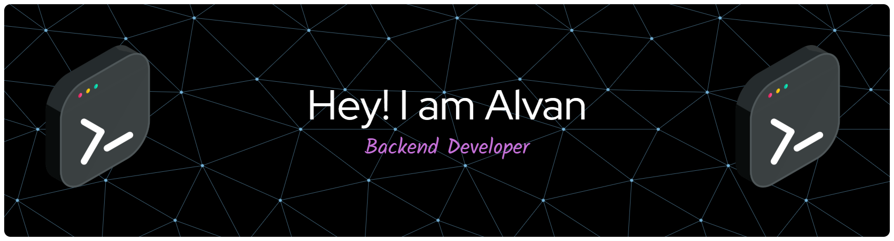

<table>
  <tr>
    <td valign="top" width="160">
      
    </td>
    <td valign="middle">
      
      <ul>
        <li>🔭 I’m currently working on <b>@zynix.id</b></li>
        <li>🌱 I’m currently learning <b>Go</b> language</li>
      </ul>
      
<i>Backend Developer | Go</i>

    </td>
  </tr>
</table>

<h3>
   
  Tech Stack
</h3>
<table width="100%">
  <tr>
    <td align="center">
      
      
      
      
      
      
      
      
      
    </td>
  </tr>
  <tr>
    <td align="center">
      
      
      
      
    </td>
  </tr>
</table>

<h3>
  
  Design Tools
</h3>

<table>
  <tr>
    <td align="center">
      
      
      
    </td>
  </tr>
</table>

### 📊 GitHub Stats

  
  <!--  -->

### 🔆 Pacman Game

<picture>
  <source media="(prefers-color-scheme: dark)" srcset="https://raw.githubusercontent.com/Alvan191/Alvan191/output/pacman-contribution-graph-dark.svg">
  <source media="(prefers-color-scheme: light)" srcset="https://raw.githubusercontent.com/Alvan191/Alvan191/output/pacman-contribution-graph.svg">
  
</picture>

<!--  -->
<!-- see you again and again -->
<!-- see you my favorite -->
<!-- please pray for me, i want rest today -->
